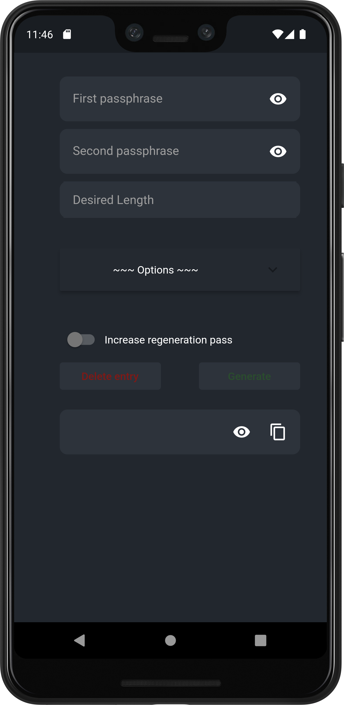
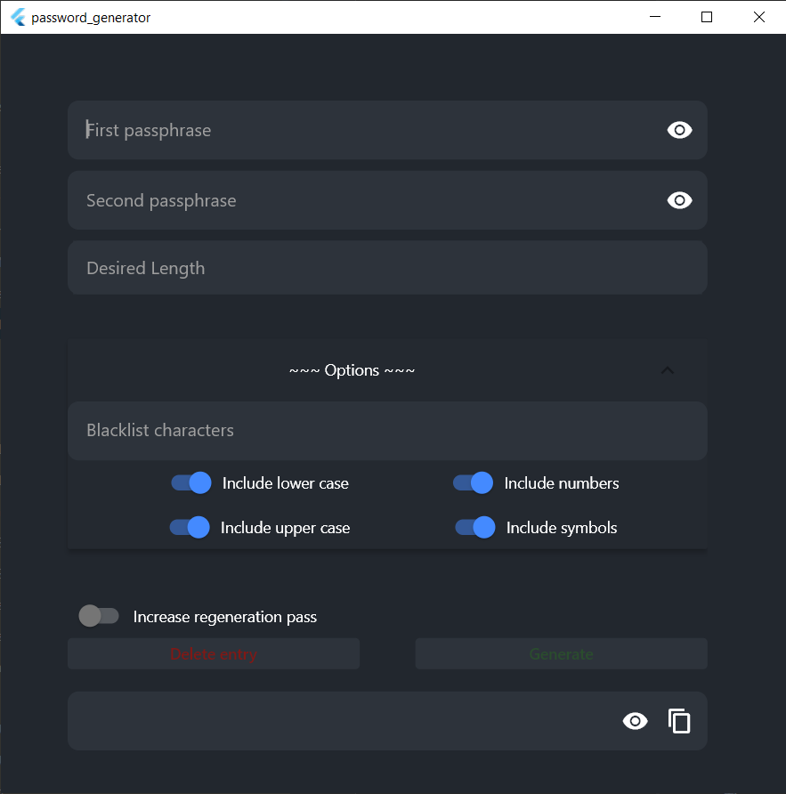

# Password Generator

A simple password generator

    
        This project is a personal study. Do not use for production or sensible data !
    

## How to run

Grab a binary in the release section of this repository.

## How to build

### Android

* Run `flutter build apk`
* The resulting artifact is located at `[project]/build/app/outputs/apk/release/` 

### Windows 

* Make sure Visual Studio `Desktop development with C++` workload is installed.
* Run `flutter build windows` to build the application
* The resulting artifact is located at `[project]/build/windows/runner/Release`
* [Optional] Run `flutter pub run msix:create` to create an msix installer

Sources:
- warning icon: [stickpng.com](https://www.stickpng.com/img/miscellaneous/safety-symbols-and-signs/warning-icon)
